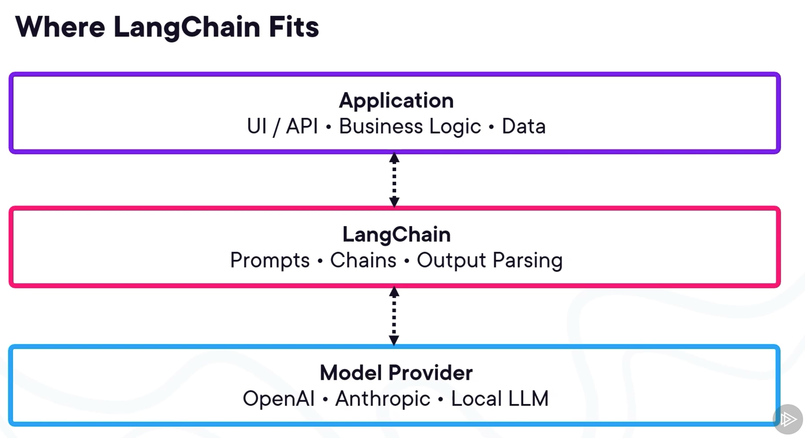

- LangChain is a framework for building `structured` and `predictable` LLM applications.
- LangChain manages how our application talks to an LLM.
- It connects prompts, models, memories, and tools so they work together coherently.
- It builds, predictable workflows where outputs from one step become inputs to another in a controlled way.

### Setting up a Minimal LangChain Development Environment

* Python installed
* LangChain installed
* model API key configured
* Jupyter Notebook ready.