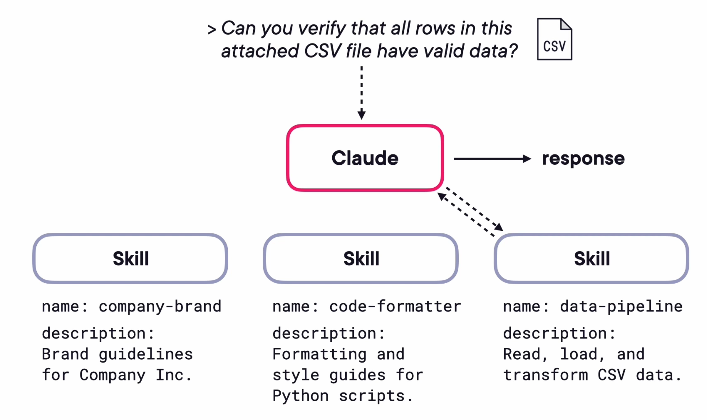
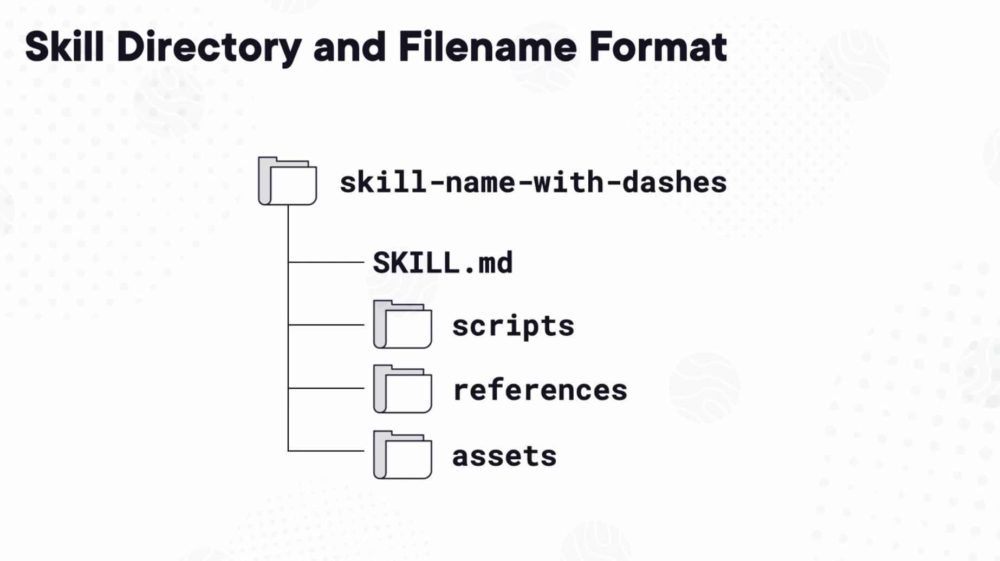
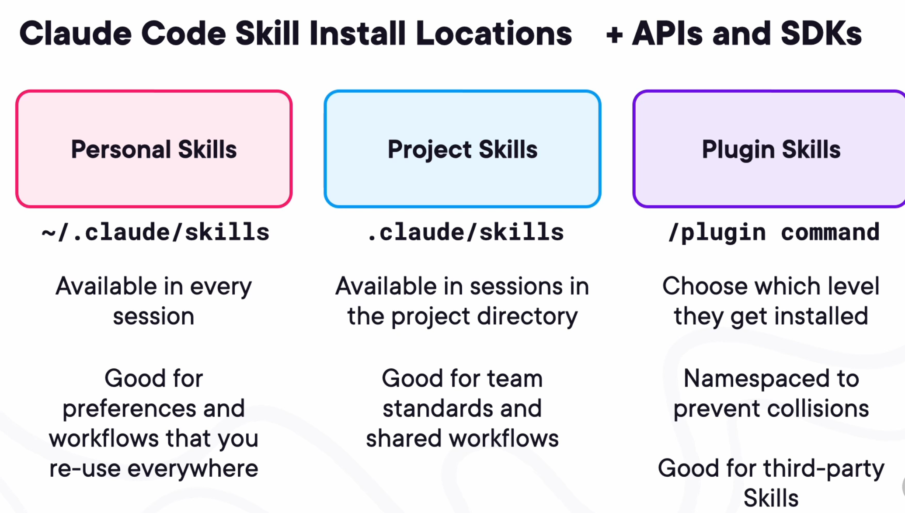
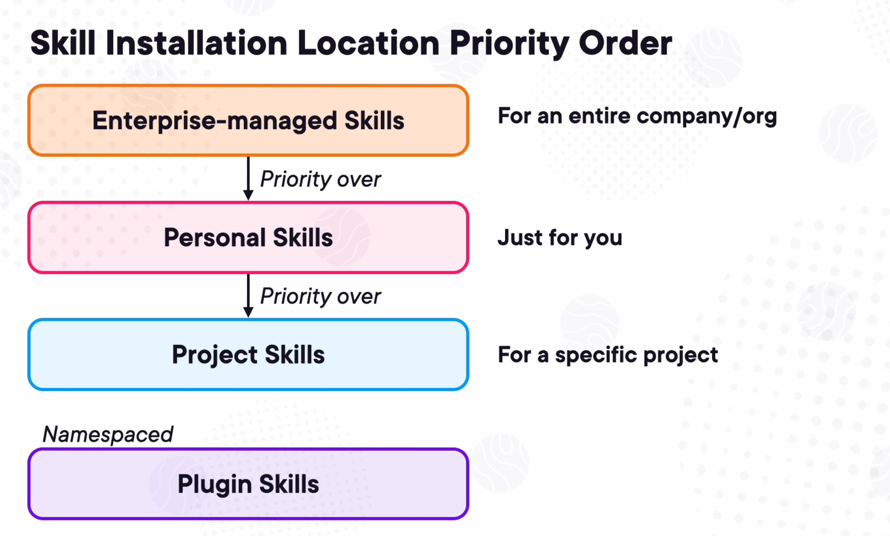
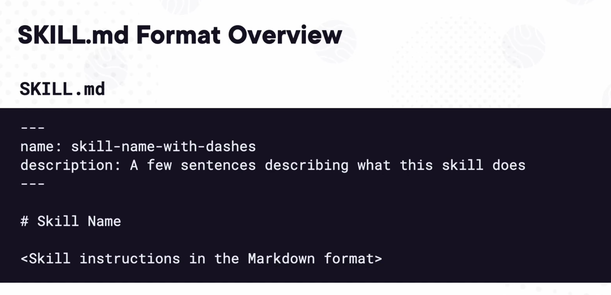

Claude

- Claude is created by Anthropic

- There are three models: Haiku, Sonnet and Opus

- Claude code: Agentic terminal based interface

- Claude ai: General purpose AI assisatnat

- behind the scences Both of Claude code and Claude ai still propmting an LLM(
  the three models above)

- Context window: claude working memory (has fix size limit)

- Claude code modes: Plan mode (plan without make any edits), Ask mode, Edit automatically

- Hooks: are a way to control actions in claude code in a deterministic way.(coomon hooks : PreToolUse {runs before any tools call}  , PosttoolUse {runs after any tools call})

- /init : create a new file named CLAUDE.md that summarizes the current state
  of the project that is in that directory, then whenever a prompt is sent the CLAUDE.md file is included as part of the system prompt section in the context.

- Règle pratique : ce que tu veux garder entre les sessions → mets-le dans
  CLAUDE.md ou MEMORY.md. Ce qui est dans la conversation peut disparaître.

- CLAUDE.md : claude reads this file at the start of every signle conversation | not practical with a lot of rules

  - Test requirement: I can add this in CLAUDE.md so claude can take this into account / i can add also Security requirement (never hardcode
    credentials ...)

          Example (this just an example, i can update it as i wish):
        
              1. write unit test for new functionality
              2. run the full test suite with npm test
              3. if test fail:
        
                * analyze the failure output
                * fix the code (no the test, unless tests are incorrect)
                * re-run tests until all pass

- Without running init to create the CLAUDE.md file, 
  Claude starts every conversation with a blank slate. It knows
  nothing about your project. You'd have to explain your tech stack, your file structure, 
  and your conventions for every single prompt. And as your conversation gets long, 
  Claude might forget things you told it earlier. But with the Claude file, that context is loaded first before anything else. 
  It's anchored at the top of Claude's memory. No matter how long your conversation gets,
  Claude always has access to your project context. This is where it gets really useful.

- `Agent SKILL`: when you have dozens or hundreds of lines of rules, it's impractical to have that data a part of every
  single prompt, even ones where those rules don't apply. There needs to be a way to store rules in a single place and only call them up when they're relevant to a conversation, and that's the problem that Agent Skills solve 

- `SKILL`:  A Skill is a packaged set of instructions that Claude can discover and load automatically 
            when it's relevant to what you're asking. Instead of repeating rules into every separate prompt, 
            you create a Skill once, put it in a place where Claude can find it, 
            and it automatically loads the full instructions whenever it's relevant.
            Anthropic originally developed this format and published it as a spec that lives at agentskills.io. 
            Since then, other tools have adopted the same format, Codex, Cursor, Gemini CLI, OpenCode, and more. 
            That means that a Skill your team writes can be shared with anyone using a compatible agent, 
            so the effort you put into writing a good Skill pays off across many other tools.
            you can create any subdirectories that you want, but the three currently recognized ones are scripts, 
            references, and assets. Telling Claude when not to use a skill is just as valuable as telling it 
            when to use a skill, especially when you've got similar Skills available.
            
            
            
            
  
- `SKILL.md`: SKILL.md files only need to have two things, a block of text at the top in this format 
              and instructions underneath in the Markdown format. 
              When you start a conversation with Claude that has Skills installed, 
              the name and description of every Skill is made available to Claude,
              and it uses those names and descriptions to determine how relevant each Skill is to the current conversation.
              That's how you can have 20 skills installed and not immediately overwhelm a conversation's context. 
              Only the relevant skills are fully loaded.
              if the description isn't clear about when the skill should activate, 
              Claude will either miss opportunities to use it or will use it at the wrong time.
              the name can't be more than 64 characters, and the description maxes out at 1,024 characters. 
              A name and description are always required, but every other field in the Frontmatter section is optional

- `Organize Skills by Task`:  it's more efficient to make Skills task‑focused instead of topic‑focused.
                              Good skill instructions answer one question. When someone asks Claude to do X, 
                              what specific steps should it follow, and what should the output look like?

            
- `progressive disclosure pattern` :  Don't load stuff until it's absolutely needed ,and it's part of what makes Skills so useful